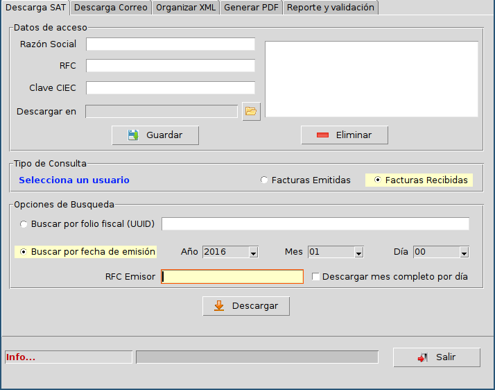
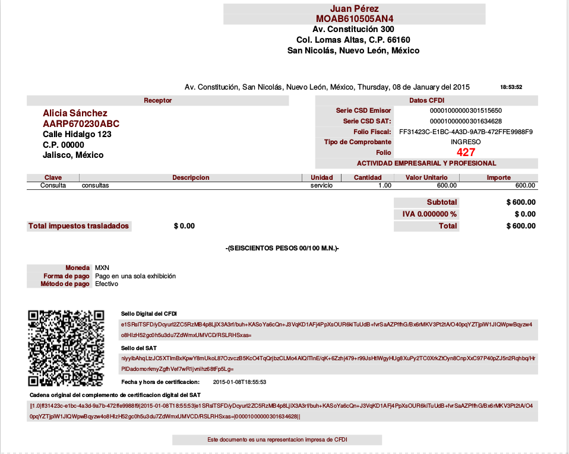

============
Introducción
============

:term:`admin-cfdi` es una aplicación de escritorio desarrollada en `Python`_ para descargar
documentos :term:`CFDI` (facturas electrónicas) directamente del :term:`SAT`,
permite también, descargar CFDIs desde correos electrónicos, validarlos y administrarlos.

.. _Python: http://python.org/

`admin-cfdi` es `software libre`_ bajo la licencia `GNU GPL 3`_ y corre en GNU/Linux y
otros sistemas operativos.
Se tienen también dos aplicaciones de línea de comando que permiten
automatizar operaciones mediante un script:

.. _software libre: https://www.gnu.org/philosophy/free-sw.es.html
.. _GNU GPL 3: https://www.gnu.org/licenses/gpl.html

``descarga-cfdi`` descarga CFDIs que cumplan determinado criterio, por
ejemplo todos los CFDIs recibidos en el mes de enero de 2015::

  descarga-cfdi --año 2015 --mes 01

  Abriendo Firefox...
     Conectando...
  Conectado...
     Buscando...
     Factura 1 de 13
     Factura 2 de 13
     Factura 3 de 13
     Factura 4 de 13
     Factura 5 de 13
     Factura 6 de 13
     Factura 7 de 13
     Factura 8 de 13
     Factura 9 de 13
     Factura 10 de 13
     Factura 11 de 13
     Factura 12 de 13
     Factura 13 de 13
     Desconectando...
  Desconectado..

Los CFDIs se guardan por omisión en la carpeta `cfdi-descarga`::

  12FB2D4B-CAE0-41CF-B344-13FE5135C773.xml  5A5108B2-2171-49B0-86D4-539DD205786A.xml  CB969AF4-0E13-441B-9CC7-0AA11831317F.xml
  1FBFA93D-F171-0B0E-CF71-4216C214E66F.xml  61F50926-7C47-4269-B612-3777881050A4.xml  F1ABE4CE-9444-4F77-A3E5-57A6559F6CB3.xml
  2968F314-90D6-4000-BBA5-E17988F2870F.xml  79FE35B0-636E-4163-8BA2-38E053E97E4C.xml  FF31423C-E1BC-4A3D-9A7B-472FFE9988F9.xml
  2CF33F44-2E2A-4F4C-904C-6213D3E8F12C.xml

``cfdi2pdf`` convierte los CFDIs de una carpeta origen a formato PDF::

  cfdi2pdf -o cfdi-descarga/ -d cfdi-pdf/

  Generando: ../cfdi-descarga/2CF33F44-2E2A-4F4C-904C-6213D3E8F12C.xml
  Generando: ../cfdi-descarga/79FE35B0-636E-4163-8BA2-38E053E97E4C.xml
  Generando: ../cfdi-descarga/61F50926-7C47-4269-B612-3777881050A4.xml
  Generando: ../cfdi-descarga/1FBFA93D-F171-0B0E-CF71-4216C214E66F.xml
  Generando: ../cfdi-descarga/F1ABE4CE-9444-4F77-A3E5-57A6559F6CB3.xml
  Generando: ../cfdi-descarga/2968F314-90D6-4000-BBA5-E17988F2870F.xml
  Generando: ../cfdi-descarga/FF31423C-E1BC-4A3D-9A7B-472FFE9988F9.xml
  Generando: ../cfdi-descarga/CB969AF4-0E13-441B-9CC7-0AA11831317F.xml
  Generando: ../cfdi-descarga/5A5108B2-2171-49B0-86D4-539DD205786A.xml
  Generando: ../cfdi-descarga/12FB2D4B-CAE0-41CF-B344-13FE5135C773.xml

Un ejemplo de los archivos PDF generados:

